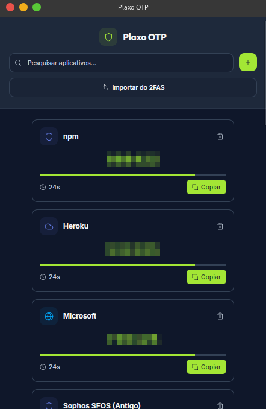
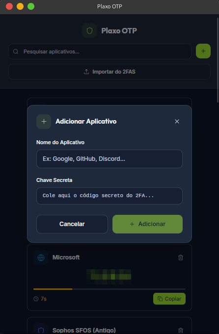
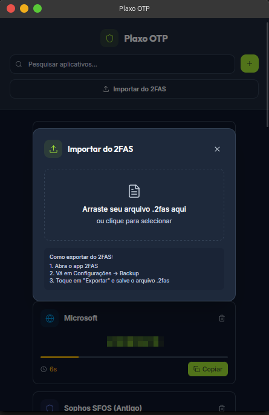

# Plaxo OTP

Aplicação desktop para geração de códigos OTP (TOTP), com o cofre local cifrado por uma senha mestre.

## Screenshots

<!-- ADICIONE AQUI A IMAGEM DA APLICAÇÃO -->



<br/>



<br/>



## Características

### **Segurança**

- **AES-256-GCM** - Cifragem autenticada: adulterar o arquivo é detectado
- **Argon2id** - Derivação da chave com custo de memória (64 MiB, 3 passagens),
  que é o que torna caro adivinhar a senha mestre offline
- **Salt aleatório por cofre** - Dois cofres com a mesma senha geram chaves diferentes
- **Nonce aleatório por gravação** - O mesmo conteúdo nunca produz o mesmo arquivo
- **Senha mestre não é retida** - Só a chave derivada fica em memória, e ela é
  zerada quando o cofre é trancado
- **Sync opcional** - O arquivo enviado ao Google Drive vai cifrado; o Google
  recebe o mesmo blob que está no disco, sem a chave

### **Interface Moderna**

- **Design System Plaxo** - Interface profissional e consistente
- **Ícones das plataformas** - Reconhecimento visual automático
- **Tema escuro** - Reduz fadiga visual
- **Responsivo** - Adapta-se ao tamanho da janela
- **Animações suaves** - Experiência fluida

### **Funcionalidades**

- **Geração OTP automática** - Códigos TOTP de 6 dígitos
- **Atualização em tempo real** - Renovação a cada 30 segundos
- **Barra de progresso visual** - Indica tempo restante
- **Cópia rápida** - Um clique para copiar código
- **Importação 2FAS** - Migre facilmente do 2FAS
- **Pesquisa inteligente** - Encontre apps rapidamente
- **System tray** - Acesso rápido pela bandeja do sistema

## Download

### Releases Automáticos

Baixe a versão mais recente na [página de releases](https://github.com/carloseduardodb/plaxo_otp_pub/releases/latest):

- **Windows**: `Plaxo-OTP_x.x.x_x64_en-US.msi`
- **macOS**: `Plaxo-OTP_x.x.x_x64.dmg`
- **Linux**: `plaxo-otp_x.x.x_amd64.deb` ou `plaxo-otp_x.x.x_amd64.AppImage`

### Instalação no Ubuntu 24.04

O Ubuntu 24.04 não inclui a biblioteca `libwebkit2gtk-4.0-37` necessária para o aplicativo. Para resolver isso:

```bash
# Adicione o repositório do Ubuntu 22.04 (Jammy)
echo "deb http://br.archive.ubuntu.com/ubuntu jammy main" | sudo tee -a /etc/apt/sources.list

# Atualize e instale as dependências necessárias
sudo apt update
sudo apt install libwebkit2gtk-4.0-dev libwebkit2gtk-4.0-37

# Instale o Plaxo OTP
sudo dpkg -i plaxo-otp_x.x.x_amd64.deb

# Se houver problemas de dependências, execute:
sudo apt --fix-broken install
```

**Nota**: Esta solução adiciona o repositório do Ubuntu 22.04 para instalar as bibliotecas webkit 4.0 necessárias. É uma solução temporária até que o aplicativo seja atualizado para usar webkit 4.1.

## Desenvolvimento

### Pré-requisitos

- **Node.js** 18+
- **Rust** 1.70+
- **Tauri CLI**: `npm install -g @tauri-apps/cli`

### Dependências do Sistema

#### Ubuntu/Debian

```bash
sudo apt update
sudo apt install libwebkit2gtk-4.1-dev libgtk-3-dev libayatana-appindicator3-dev librsvg2-dev
```

#### Fedora

```bash
sudo dnf install webkit2gtk4.1-devel gtk3-devel libappindicator-gtk3-devel librsvg2-devel
```

#### macOS

```bash
# Xcode Command Line Tools são suficientes
xcode-select --install
```

### Instalação

```bash
# Clone o repositório
git clone https://github.com/carloseduardodb/plaxo_otp_pub.git
cd plaxo_otp_pub

# Instale dependências
npm install

# Execute em modo desenvolvimento
npm run tauri dev

# Build para produção
npm run tauri build
```

### Rodando os testes

```bash
cd src-tauri && cargo test
```

Os testes do cofre rodam num diretório temporário e não tocam em
`~/.plaxo-otp`.

### Sync com Google Drive (opcional)

O repositório não contém credenciais do Google — e não deve conter. Para
habilitar o sync, crie seu próprio cliente OAuth e compile com:

```bash
export PLAXO_GOOGLE_CLIENT_ID="...apps.googleusercontent.com"
export PLAXO_GOOGLE_CLIENT_SECRET="..."   # opcional
npm run tauri build
```

Sem essas variáveis o app compila e funciona normalmente; apenas o sync reporta
que não está configurado. O passo a passo está em
[docs/google-drive-setup.md](docs/google-drive-setup.md).

## Como Usar

### Primeira Configuração

1. **Abra a aplicação** - Ela aparecerá na bandeja do sistema
2. **Clique no ícone** da bandeja para abrir
3. **Crie sua senha mestre** - Esta será usada para criptografar seus dados
4. **Adicione seus primeiros apps** - Use o botão "+" ou importe do 2FAS

### Adicionando Aplicativos

1. **Clique no botão "+"** no topo da aplicação
2. **Digite o nome** do aplicativo (ex: "Google", "GitHub")
3. **Cole a chave secreta** do 2FA (código QR em texto)
4. **Clique em "Adicionar"**

### Importando do 2FAS

1. **No app 2FAS**: Configurações → Backup → Exportar
2. **No Plaxo OTP**: Clique em "Importar do 2FAS"
3. **Selecione o arquivo** .2fas exportado
4. **Aguarde a importação** - Todos os apps serão adicionados

### Usando Códigos OTP

- **Códigos são gerados automaticamente** a cada 30 segundos
- **Clique em "Copiar"** para copiar o código atual
- **Barra de progresso** mostra tempo restante
- **Pesquise** pelo nome do aplicativo

## Segurança

### Criptografia

- **AES-256-GCM**: Algoritmo de criptografia militar
- **Argon2id**: Derivação da chave a partir da senha mestre
  (64 MiB de memória, 3 iterações, paralelismo 4 — baseline da OWASP)
- **Nonce aleatório**: Gerado a cada gravação, nunca reutilizado
- **Salt aleatório de 16 bytes**: Sorteado por cofre e guardado no próprio
  arquivo, o que inviabiliza tabelas pré-computadas contra vários usuários

### Armazenamento

- **Arquivo criptografado**: `~/.plaxo-otp/apps.enc`
- **Chave na memória**: Nunca salva no disco
- **Permissões de usuário**: Apenas você pode acessar

### Formato do cofre

O arquivo é base64 sobre a seguinte estrutura:

```text
"PLX2" | salt (16 bytes) | nonce (12 bytes) | ciphertext AES-256-GCM
```

Cofres gravados pela versão 1.3.3 ou anterior não têm cabeçalho e usavam uma
derivação fraca (um único SHA-256 com salt fixo no binário). Eles continuam
sendo lidos e são **migrados automaticamente** para o formato acima no primeiro
desbloqueio — sem exportar nem recadastrar nada. O arquivo anterior fica como
`apps.enc.backup`.

### O que isto não protege

Vale ser explícito, já que o cofre guarda segundo fator:

- **Malware com seu usuário.** Enquanto o app está destrancado a chave está na
  memória do processo. Um infostealer rodando como você consegue os segredos.
- **Senha mestre fraca.** O Argon2id encarece cada tentativa, não torna o
  ataque impossível. Uma senha curta continua quebrável.
- **Os binários não são assinados** nem reprodutíveis. Confira o hash das
  releases ou compile você mesmo.
- **Sem auditoria externa.** O código está aberto justamente para ser revisado;
  ele não passou por auditoria independente.

## Arquitetura

### Frontend

- **React 18** - Interface moderna e reativa
- **TypeScript** - Tipagem estática para maior confiabilidade
- **Tailwind CSS** - Design system consistente
- **Lucide React** - Ícones profissionais

### Backend

- **Rust** - Performance e segurança máximas
- **Tauri** - Framework para aplicações desktop
- **TOTP-RS** - Geração de códigos OTP
- **AES-GCM** - Criptografia de dados

### Dependências Principais

```toml
[dependencies]
tauri = "1.5"
serde = "1.0"
totp-rs = "5.0"
aes-gcm = "0.10"
sha2 = "0.10"
uuid = "1.0"
```

## Roadmap
- Sincronização em nuvem.
- Aceite colar imagem QRCode ao adicionar novo aplicativo.
- Monitoramento do salvamento em nuvem.
- Novo app mobile.
- Compartilhamento de codigo de apps entre dispositivos.

## Contribuindo

1. **Fork** o projeto
2. **Crie uma branch** para sua feature (`git checkout -b feature/nova-feature`)
3. **Commit** suas mudanças (`git commit -am 'Adiciona nova feature'`)
4. **Push** para a branch (`git push origin feature/nova-feature`)
5. **Abra um Pull Request**

## Licença

Este projeto está licenciado sob a licença MIT - veja o arquivo [LICENSE](LICENSE) para detalhes.

## Suporte

- **Issues**: [GitHub Issues](https://github.com/carloseduardodb/plaxo_otp_pub/issues)
- **Discussões**: [GitHub Discussions](https://github.com/carloseduardodb/plaxo_otp_pub/discussions)
- **Falhas de segurança**: não abra issue pública — veja [SECURITY.md](SECURITY.md)

## Agradecimentos

- **Tauri Team** - Framework incrível para apps desktop
- **Rust Community** - Linguagem segura e performática
- **React Team** - Interface moderna e reativa
- **2FAS** - Inspiração para funcionalidades

---

<div align="center">
  <strong>Feito com amor pela equipe Plaxo</strong>
</div>
